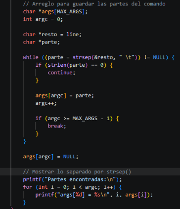
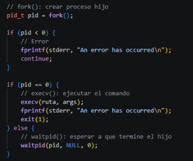
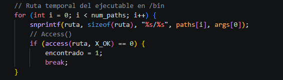
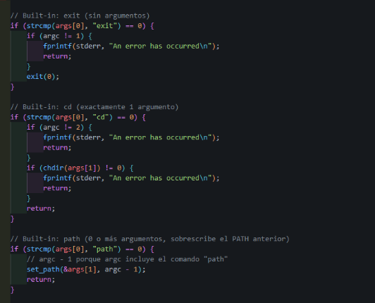
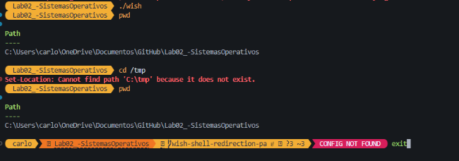
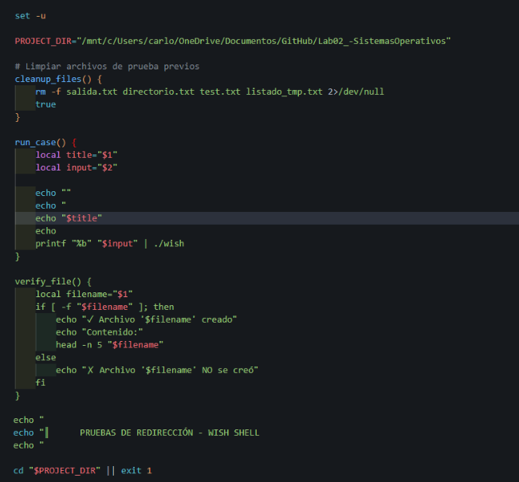
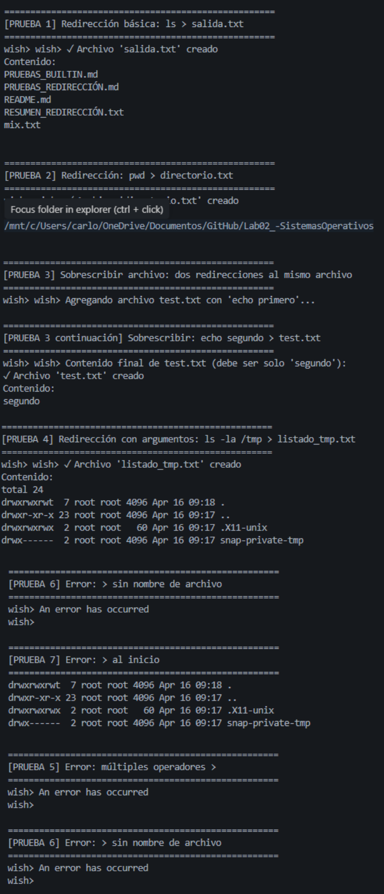
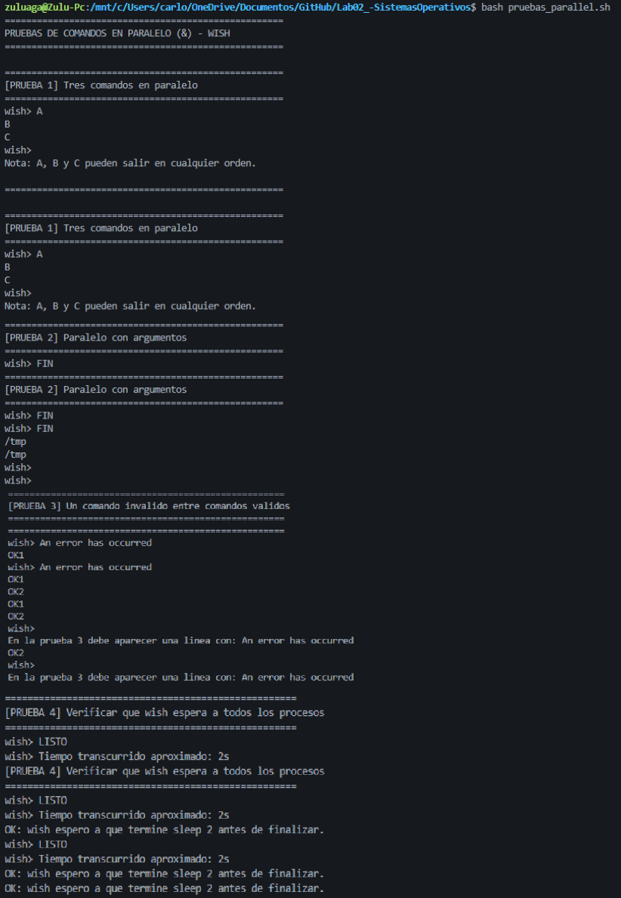
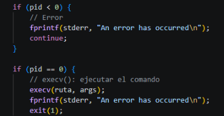

# Laboratorio 02 - Sistemas Operativos
Elaborado por: 
- Carlos Andres Zuluaga Amaya
  andres.zuluaga6@udea.edu.co
- Duván Antonio Arboleda Botero
  duvan.arboleda1@udea.edu.co

Link de video: https://www.youtube.com/watch?v=_y5xPk49RNc 

Link de informe en pdf: https://drive.google.com/file/d/1L1P2S25usq1dPNzrxPPkvaS8npLElL1A/view?usp=sharing 
## Introducción
En este laboratorio se implementa un shell básico (`wish`) que funciona como un intérprete de comandos simple. El shell puede ejecutarse tanto en modo interactivo como en modo batch (leyendo comandos desde un archivo).

## Objetivo
Implementar un shell que:
- Lee comandos del usuario (modo interactivo) o desde un archivo (modo batch)
- Ejecuta programas externos usando `fork()` y `execv()`
- Implementa comandos built-in: `exit`, `cd` y `path`
- Maneja errores adecuadamente

## Compilación

### En Linux/Unix directamente:
```bash
gcc -Wall -o wish wish.c
```

### En Windows (usando WSL):
```bash
wsl bash -c "cd /ruta/al/proyecto && gcc -Wall -o wish wish.c"
```

## Ejecución
El shell se puede probar en modo interactivo con ./wish, donde el usuario escribe comandos manualmente, o también desde el modo batch donde el programa lee y ejecuta automáticamente las instrucciones guardadas en un archivo.

### Modo interactivo:
```bash
./wish
wish> pwd
wish> cd /tmp
wish> exit
```

### Modo batch (desde archivo):
```bash
./wish comandos.txt
```

Donde `test_commands.txt` contiene los comandos a ejecutar, uno por línea.

## Desarrollo
### Creación inicial del shell wish
Para cumplir con este paso se creó inicialmente un archivo wish.c, y se compiló para generar el ejecutable con el nombre wish. La compilación se realizó con el compilador gcc de forma que pudiera ejecutarse desde terminal con el comando ./wish. 

### Shell básico
En este paso se desarrolló la estructura básica del shell wish. El shell fue construido en un ciclo infinito para que nunca termine por sí solo, sino que continúe pidiendo comandos una y otra vez. Se implementó getline() para leer una línea de entrada con capturar el comando completo, incluyendo sus argumentos. Si getline() devuelve -1, significa que se alcanzó el fin del archivo, es decir, un EOF. 

```c
#include <stdio.h>
#include <stdlib.h>

int main() {
    char *line = NULL;
    size_t len = 0;

    // Bucle infinito - leer comandos
    while (1) {
        printf("wish> ");
        fflush(stdout);

        // Leer línea de entrada
        if (getline(&line, &len, stdin) == -1) {
            break;
        }

        printf("    %s", line);
    }

    free(line);
    return 0;
}
```

Se implementó la función strsep(), lo que permite separar el comando de sus argumentos utilizando los espacios como delimitadores. Y Se realizó una impresión de prueba para verificar que tanto el comando como los argumentos se reconocen correctamente de forma independiente.



Ejemplo:
```bash
gcc -o wish wish.c
./wish
wish> ls
ls
```

Implementación de fork(), execv() y waitpid: 
- Implementación de Fork(): Se crea un proceso hijo copiando el proceso actual, por lo cual existen dos procesos: el padre y el hijo.
- Implementación de execv(): Sirve para reemplazar el código del proceso actual por otro programa. Ya que el hijo existe gracias a fork(), entonces el hijo hace execv y entonces el hijo deja de ser “shell” y se convierte en el programa (comando colocado)
- Implementación de wait() / waitpid(): Sirven para que el proceso padre espere a que termine el hijo. Después de terminar, vuelve a mostrar wish



En conclusion se creó un proceso hijo mediante fork(). Luego, el hijo ejecutó el comando usando execv(), mientras que el proceso padre esperó su finalización mediante waitpid(). Con esta implementación se permitió ver el comportamiento básico descrito para un shell.

### Paths
Se construyó la ruta completa del ejecutable a partir del nombre del comando ingresado, si el comando es ls, la ruta generada es /bin/ls



Ejemplos:

Implementación de ls
```bash
./wish
wish> ls
README.md  wish  wish.c
```
Ejecución con comandos
```bash
wish> ls -l
total 24
-rwxrwxrwx 1 dkali dkali   258 Apr  9 19:23 README.md
-rwxrwxrwx 1 dkali dkali 16496 Apr 10 01:24 wish
-rwxrwxrwx 1 dkali dkali  2010 Apr 10 01:23 wish.c
```

Tambien se implementó la llamada access(ruta, X_OK) con el fin de verificar si el archivo correspondiente al comando existe en la ruta construida, de este modo antes de crear el proceso con fork(), el shell valida que el ejecutable sea accesible.

### Comandos Built-in
En esta parte se implementó los siguientes comandos internos del shell:

- **`exit`**: Para finalizar el shell, es decir, finaliza correctamente con exit(0).
  - ✓ `exit` → Cierra el shell
  - ✗ `exit 1` → Error

- **`cd <directorio>`**: Para cambiar el directorio actual del shell con el uso de llamado chdir(), verificando que reciba exactamente un argumento correspondiente al directorio destino. Requiere un argumento
  - ✓ `cd /tmp` → Funciona
  - ✗ `cd` → Error (sin argumentos)
  - ✗ `cd /tmp /home` → Error (múltiples argumentos)
  - ✗ `cd /inexistente` → Error (directorio no existe)

- **`path <dir1> <dir2> ...`**: Establece la ruta de búsqueda del shell. Puede tomar 0 o más argumentos.
  - ✓ `path /bin /usr/bin` → Establece PATH
  - ✓ `path` → Borra PATH (no se pueden ejecutar programas)
  - Nota: Sobrescribe el PATH anterior



Prueba: Podemos ver que todos funcionan correctamente. Y al dar exit cierra la terminal correctamente 



### Pruebas de redirección 
Se implementó la redirección de salida del shell mediante el operador >. Esta funcionalidad permite que la salida de un comando externo sea almacenada en un archivo en lugar de mostrarse en pantalla. 



Pruebas automatizadas para verificar la redirección:



### Comandos en Paralelo
Vamos con la implementación de la ejecución de varios comandos en una misma línea usando el operador &, de manera que el shell los lance en paralelo, el shell debe permitir entradas como:

```bash
cmd1 & cmd2 args1 args2 & cmd3 args1
```

Pruebas automatizadas para verificar los comandos en paralelo:



### Validaciones de error
Todos los errores se reportan con: `An error has occurred\n`

Casos que generan errores:
- Comando no existente
- Argumentos inválidos para built-ins
- Problemas al cambiar directorio
- Fallos en fork() o execv()



## Conclusión
Durante el desarrollo de este laboratorio se logro implementar de manera práctica los conceptos fundamentales 'API de procesos' en Linux mediante la implementación de un shell básico,  (wish), por medio de comandos internos, ejecución de procesos, redirección y paralelismo. Se fortaleció la comprensión del funcionamiento del sistema operativo y de la interacción entre el usuario con el sistema.
